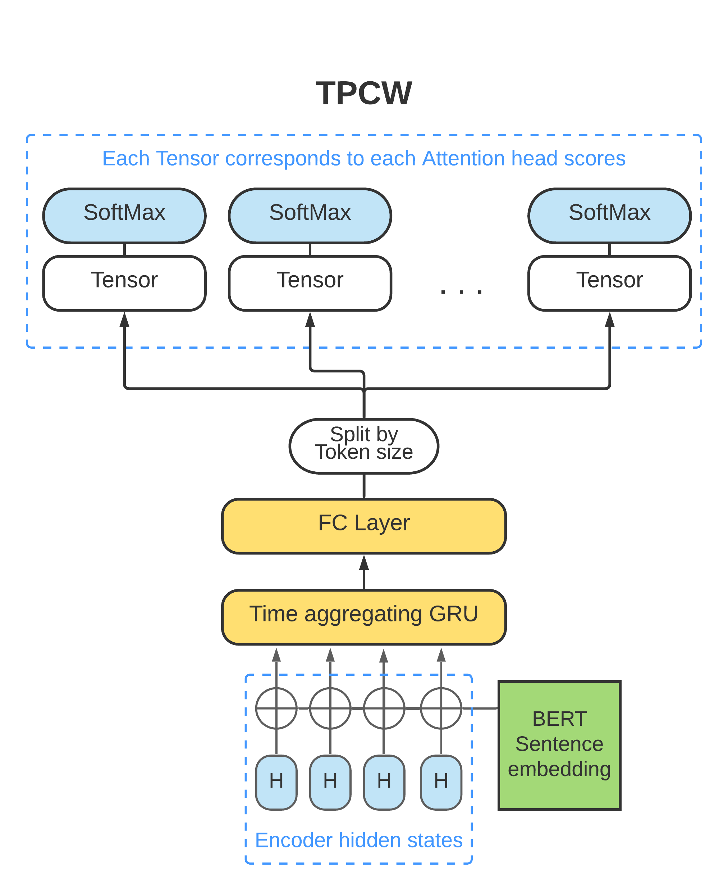
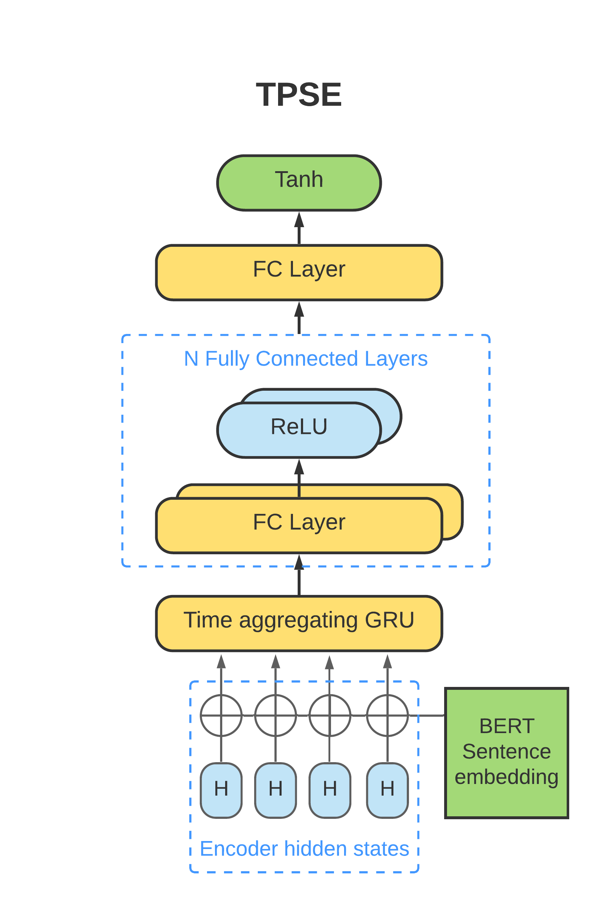
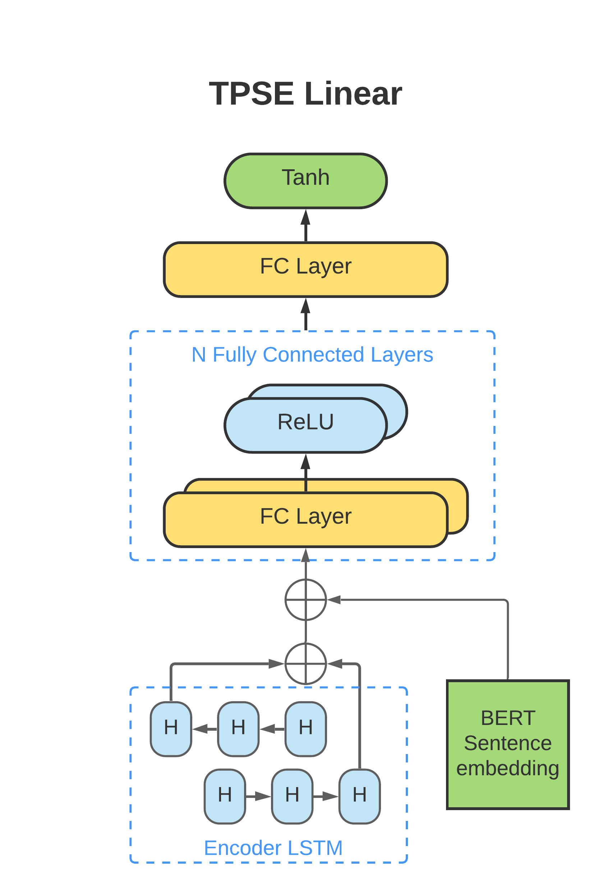
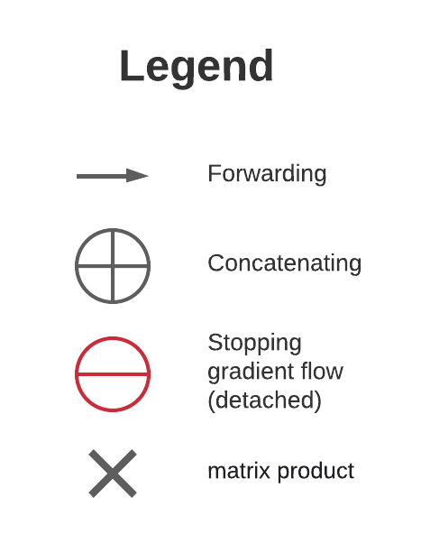

This is a fork of TP-GST-BERT-Tacotron2 that adds new stuff.

---

## TP-GST-BERT-Tacotron2 

This is a realization of the model proposed by [SberDevices team](https://m.habr.com/ru/company/sberdevices/blog/548812) and extended with quicker TP-GST module by me  
The training process has been carried out on a russian language dataset
### Model contains:
* Tacotron2 Encoder + Decoder
* Global Style Tokens module
* 3 Text-predicting style embedding models
* BERT model

    
    
    
    

## Pre-requisites
1. NVIDIA GPU + CUDA cuDNN

## Setup
1. Clone this repo: `git clone https://github.com/lightbooster/TP-GST-BERT-Tacotron2.git`
2. CD into this repo: `TP-GST-BERT-Tacotron2`
3. Initialize submodule: `git submodule init; git submodule update`
4. Install [PyTorch]
5. Install [Apex]
6. Install python requirements or build docker image 
    - Install python requirements: `pip install -r requirements.txt`  
**NOTE**: elaborated example of SetUp in [notebook demo.ipynb](./demo.ipynb)

### Prepare BERT
0. Download BERT checkpoint (I used RuBERT from [deeppavlov.ai](http://docs.deeppavlov.ai/en/master/features/models/bert.html))
1. Move BERT checkpoint, config and vocabulary into [/bert](./bert) folder or setup related paths in [hparams.py](/hparams.py)
2. Modify BERT hyper parameters in [hparams.py](/hparams.py) if those are needed

## Training
1. Update the filelists inside the filelists folder to point to your data
2. `python train.py --output_directory=outdir --log_directory=logdir`
3. (OPTIONAL) `tensorboard --logdir=outdir/logdir`

### Training using a pre-trained model
Training using a pre-trained model can lead to faster convergence  
By default, the speaker embedding layer is [ignored]

1. Download my pretrained model [checkpoint](https://drive.google.com/file/d/109-XGAOfIVnyoKXgKGr1Pt5dLl6Ad2tP/view?usp=sharing) on a russian language dataset 
**NOTE:** checkpoint doesn't contain BERT model weights, use ceparate checkpoint for it
2. `python train.py --output_directory=outdir --log_directory=logdir -c {PATH_TO_CHECKPOINT} --warm_start`

### Multi-GPU (distributed) and Automatic Mixed Precision Training
1. `python -m multiproc train.py --output_directory=outdir --log_directory=logdir --hparams=distributed_run=True,fp16_run=True`

## Training and Inference demo
M-AILABS data preprocessing, train configuration and inference demos are represented in the [notebook demo.ipynb](./demo.ipynb)

## Related repos
[WaveGlow](https://github.com/NVIDIA/WaveGlow) Faster than real time Flow-based
Generative Network for Speech Synthesis.

## References
* [Nvidia's Mellotron](https://github.com/NVIDIA/mellotron) (Tacotron2 + GST) is a basement of work
* *Stanton, D., Wang, Y., & Skerry-Ryan, R. J. (2018, August 4)* **Predicting Expressive Speaking Style From Text In End-To-End Speech Synthesis** [https://arxiv.org/abs/1808.01410](https://arxiv.org/abs/1808.01410)
* *Skerry-Ryan, RJ, Battenberg, Eric, Xiao, Ying, Wang, Yuxuan, Stanton, Daisy, Shor, Joel, Weiss, Ron J., Clark, Rob, and Saurous, Rif A.* **Towards end-to-end prosody transfer for 	expressive speech synthesis with Tacotron** [https://arxiv.org/abs/1803.09047](https://arxiv.org/abs/1803.09047)
* *Sber Devices* **Synthesis of speech of virtual assistants Salute** [https://habr.com/ru/company/sberdevices/blog/548812/](https://habr.com/ru/company/sberdevices/blog/548812/)

